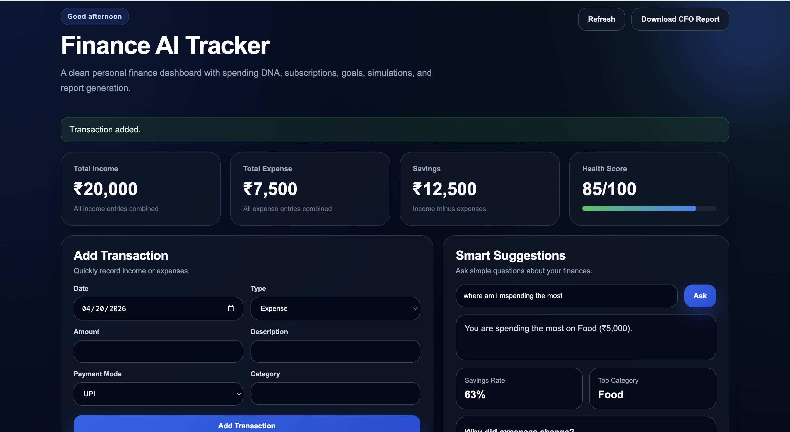
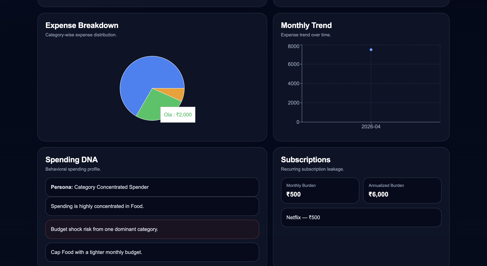
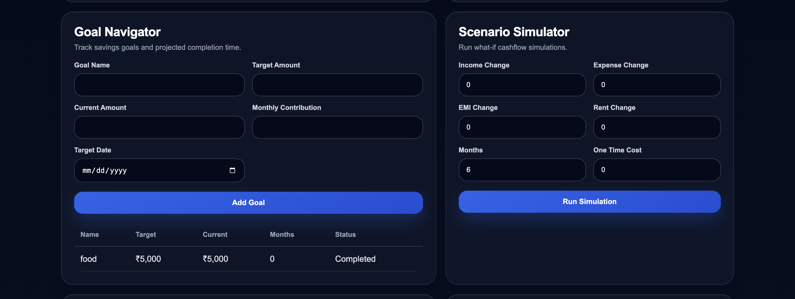
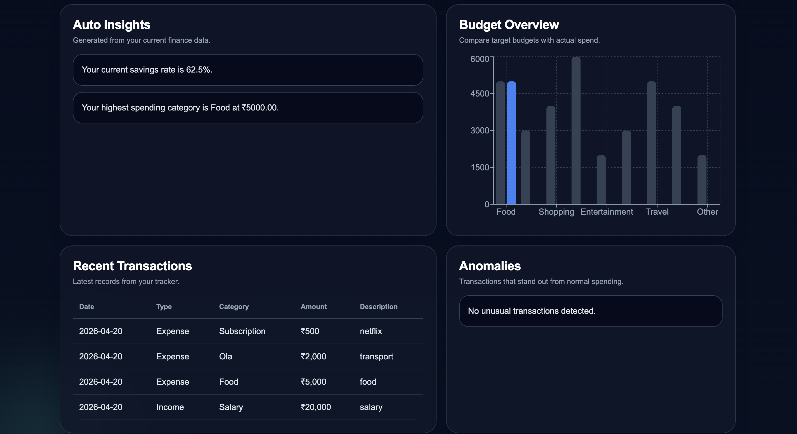

# 🚀 Finance AI Tracker  
### 💸 AI-Powered Personal Finance Intelligence Platform


---


---

## 📌 Overview

**Finance AI Tracker** is a **full-stack personal finance intelligence platform** designed to go far beyond a normal expense tracker.

Instead of only storing transactions and showing totals, this platform works like a **personal finance copilot**. It combines:

- transaction tracking
- budget analysis
- anomaly detection
- behavioral spending insights
- goal navigation
- financial simulation
- subscription leakage detection
- automated CFO-style reporting

This makes the project much more than a dashboard. It behaves like a **mini financial decision engine**.

---

## 🌟 Why This Project Is Different

Most finance tracker projects on GitHub usually stop at:

- add transaction
- show pie chart
- show monthly summary
- basic CRUD

This project goes much deeper.

### What makes this stand out:

- ✅ **AI-style financial insights**, not just raw totals
- ✅ **Behavioral Spending DNA** to profile user spending habits
- ✅ **Anomaly Detection** using machine learning
- ✅ **Goal Navigator** to estimate goal completion timelines
- ✅ **Scenario Simulator** for what-if cashflow projections
- ✅ **Subscription Leakage Detector** for recurring spending burden
- ✅ **Explainable expense trend analysis**
- ✅ **CFO-style downloadable report**
- ✅ **Full-stack architecture with React + FastAPI**
- ✅ **SQLite-backed structured data layer**
- ✅ **Authentication-ready backend foundation**

This is built like a **real product**, not a tutorial clone.

---

## 🎯 Core Idea

The goal of this project is to answer questions like:

- Where is my money going?
- What category is silently draining my income?
- What happens if my monthly expenses increase?
- Can I reach my savings goal on time?
- What subscriptions are costing me every month?
- Did my expenses spike unusually?
- What kind of spender am I?

---

## 🧠 Key Features

### 1. 📥 Transaction Management
Users can:

- add income and expense entries
- categorize spending automatically or manually
- view recent transactions
- update and delete transactions in advanced versions

Each transaction includes:

- date
- type
- category
- amount
- description
- payment mode

---

### 2. 📊 Financial Summary Dashboard
The dashboard provides instant visibility into:

- total income
- total expenses
- total savings
- financial health score

This creates a clear snapshot of overall money flow.

---

### 3. 🧾 Budget vs Actual Analysis
The system compares actual expenses against predefined category budgets such as:

- Food
- Transport
- Shopping
- Bills
- Entertainment
- Health
- Travel
- Education
- Other

This helps users quickly identify overspending categories.

---

### 4. 🤖 AI-Style Financial Insights
The backend generates intelligent finance insights such as:

- current savings rate
- top spending category
- cashflow quality
- major spending drivers

These insights make the platform feel more like a finance assistant than a simple tracker.

---

### 5. 🚨 Anomaly Detection
The system uses **Isolation Forest** from **Scikit-learn** to detect unusually large or irregular expenses.

Examples:
- unusually large food order
- outlier travel expense
- uncommon spending spikes

This helps identify suspicious or abnormal financial behavior.

---

### 6. 🧬 Spending DNA
One of the most unique parts of the project.

The platform analyzes user behavior to generate a **spending persona**, such as:

- Balanced Planner
- Category Concentrated Spender
- Weekend Spike Spender
- Salary-Week Spender

It also provides:
- key traits
- risks
- recommendations

This turns raw finance data into human behavior insights.

---

### 7. 💳 Subscription Leakage Detection
The system scans transactions for likely subscription-based expenses, including patterns such as:

- Netflix
- Spotify
- Prime
- YouTube
- recurring subscription-style charges

It calculates:

- monthly subscription burden
- annualized burden
- likely recurring merchants

This gives users visibility into silent recurring expenses.

---

### 8. 🎯 Goal Navigator
Users can create financial goals such as:

- Emergency Fund
- Laptop Upgrade
- Europe Trip
- Vehicle Purchase
- Education Fund

The platform estimates:

- current progress
- projected months to completion
- goal status
- contribution requirements

This makes the tracker action-oriented, not just analytical.

---

### 9. 📈 Scenario Simulation Engine
The simulator answers “what-if” financial planning questions.

Users can simulate:

- income increase or decrease
- rent increase
- EMI changes
- expense changes
- one-time costs
- multi-month cashflow impact

This feature transforms the project into a **decision-support system**.

---

### 10. 🧠 Why Expense Changed
The platform can explain expense change patterns.

Instead of just saying expenses are higher, it can say:

- how much expenses changed
- which category caused the shift
- which period contributed most

This gives finance explanations, not just finance numbers.

---

### 11. 📄 CFO Report Generator
The application can generate a professional **CFO-style PDF report** covering:

- executive summary
- total income
- total expense
- savings
- top insights
- spending persona
- subscriptions

This is a strong product feature rarely found in student projects.

---

### 12. 🔐 Authentication-Ready Architecture
The backend includes the foundation for:

- user registration
- user login
- password hashing
- JWT token generation

This moves the project from “demo tool” to “deployable product architecture”.

---

## 🏗️ System Architecture

```text
React Frontend (Vite)
        ↓
FastAPI Backend
        ↓
Analytics Engine
 ├── Budget Analysis
 ├── Spending DNA
 ├── Subscription Detector
 ├── Goal Navigator
 ├── Scenario Simulator
 ├── Anomaly Detection
 └── Report Generator
        ↓
SQLite Database

---

🧱 Project Structure

personal-finance-ai-tracker/
│
├── app/
│   ├── analytics/
│   │   ├── persona.py
│   │   ├── subscriptions.py
│   │   ├── goals.py
│   │   ├── simulator.py
│   │   └── reporting.py
│   │
│   ├── core/
│   │   └── security.py
│   │
│   ├── db/
│   │   ├── database.py
│   │   └── models.py
│   │
│   ├── routes/
│   │   ├── auth.py
│   │   └── transactions.py
│   │
│   ├── main.py
│   ├── schemas.py
│   └── services.py
│
├── frontend/
│   ├── src/
│   │   ├── App.jsx
│   │   ├── App.css
│   │   └── main.jsx
│   ├── package.json
│   └── vite.config.js
│
├── data/
│   ├── transactions.csv
│   └── goals.csv
│
├── finance_tracker.db
├── requirements.txt
├── render.yaml
└── README.md

---

⚙️ Tech Stack

Frontend
React
Vite
Axios
Recharts
Custom CSS

Backend
FastAPI
Uvicorn
Pydantic
SQLAlchemy

Database
SQLite

Machine Learning / Analytics
Pandas
Scikit-learn
Isolation Forest

Auth / Security
Passlib
JWT (python-jose)

Reporting
ReportLab

---

🚀 Installation and Setup

1. Clone the repository
git clone https://github.com/rohanramgopal/finance-ai-tracker.git
cd finance-ai-tracker

2. Backend setup
python3 -m venv venv
source venv/bin/activate
python -m pip install --upgrade pip
python -m pip install -r requirements.txt

3. Run backend server
python -m uvicorn app.main:app --reload --host 127.0.0.1 --port 8000

Backend will run at:

http://127.0.0.1:8000

Swagger docs:

http://127.0.0.1:8000/docs

4. Frontend setup

Open a new terminal:

cd frontend
npm install
npm run dev

Frontend will run at:

http://127.0.0.1:5173

🧪 Example Use Cases

Personal Finance Tracking
Add daily spending and income
Monitor savings performance
Track category-wise expense behavior

Budget Monitoring
See which categories exceed budget
Understand spending concentration

Financial Planning
Create and track goals
Simulate future cashflow conditions
Assess readiness for planned purchases

Risk Awareness
Detect unusual transactions
Identify hidden subscription burden
Understand behavior-based risk

Reporting
Generate monthly finance report
Share professional summary PDF


📌 Main API Endpoints
Core
GET /
GET /health

Transactions
GET /transactions
POST /transactions
PUT /transactions/{id}
DELETE /transactions/{id}

Insights
GET /summary
GET /insights
GET /budgets
GET /anomalies
GET /why-expense-change

Intelligence
GET /spending-dna
GET /subscriptions
POST /simulate

Goals
POST /goals
GET /goals

Auth
POST /auth/register
POST /auth/login

Reporting
GET /report

---

📊 What the Dashboard Shows

The React frontend includes:

premium dashboard cards
summary metrics
health score progress
smart suggestions
expense breakdown chart
monthly trend chart
budget chart
anomalies
spending DNA
subscriptions
goal navigator
scenario simulator
recent transactions table

--- 
💡 Sample Smart Insights

Examples of the kind of outputs the app can generate:

“Your current savings rate is 26.6%.”
“Your highest spending category is Food at ₹6750.”
“Expenses changed by 34.2%. Major driver: Food.”
“Monthly subscriptions cost ₹698 and annualize to ₹8376.”
“You are a Weekend Spike Spender.”


--- 

🔥 What Makes This Resume-Level Strong

This project is not just:

a form
a table
a chart

It combines:

engineering
finance logic
machine learning
analytics
UX
reporting
scenario planning

That makes it much stronger than standard GitHub “expense tracker” projects.

📈 Future Enhancements

Potential next upgrades:

multi-user dashboards
cloud database (PostgreSQL)
OpenAI / local LLM-powered finance assistant
transaction import from bank CSV
recurring expense prediction
notification system
email reports
role-based admin analytics
deploy on Render + Vercel
mobile responsive finance companion app

🏆 Why This Project Stands Out

Finance AI Tracker stands out because it evolves from a normal tracker into an AI-assisted financial intelligence platform.

It is different because it does not only answer:

“What did I spend?”

It also answers:

“Why did spending rise?”
“What kind of spender am I?”
“What subscriptions are draining me?”
“Will I reach my goal?”
“What happens if my expenses increase?”
“What does my monthly CFO summary look like?”


---

## 📸 Screenshots

<p align="center">
  
  
</p>

<p align="center">
  
  
</p>

--- 
👨‍💻 Author

Rohan Ramgopal
GitHub: rohanramgopal
